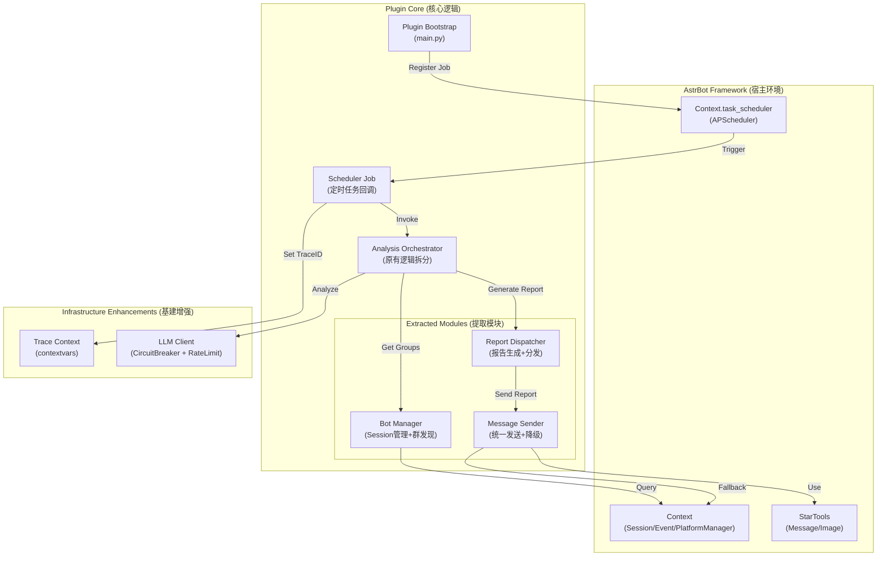

# 02. 架构设计 (Architecture Design - Framework Aligned)

## 1. 总体架构图 (Pragmatic Architecture)

本架构旨在最大限度复用 AstrBot 框架能力，通过职责拆分（而非分层解耦）来降低 `AutoScheduler` 的复杂度。

## 2. 核心组件详解

### 2.1 任务调度 (Scheduler)
**不再自建循环**。直接使用 AstrBot 提供的 `Context.task_scheduler` (APScheduler 实例)。
- **注册**: 在 `__init__` 或 `OnPlatformLoaded` 中注册 cron job。
- **优势**: 自动处理时区、任务持久化（如果配置）、优雅关闭。

### 2.2 消息发送 (MessageSender)
**统一发送入口**。将散落在各处的发送逻辑收敛到 `src/core/message_sender.py`。
- **职责**:
    1.  **协议适配**: 优先构建 `AstrMessageEvent` (即使是主动发送，也可构造虚拟 Event)，调用 `Context.send_message`。
    2.  **降级策略**: URL发送失败 -> 下载转Base64发送 -> 纯文本回退。
    3.  **合并转发**: 封装 OneBot v11 的 Forward Message 构建细节。
- **依赖**: 依赖 `Context` 和 `StarTools`，而非直接依赖 `bot.api`。

### 2.3 分析编排 (AnalysisOrchestrator / ReportDispatcher)
**逻辑拆分**。
- `ReportDispatcher`: 接收 `AnalysisResult`，决定调用哪个渲染器（HTML/Text/PDF），并调用 `MessageSender` 发送。
- `AnalysisOrchestrator`: 负责并发控制（Semaphore）和错误处理（Partial Failure）。

### 2.4 可观测性 (TraceContext)
**零侵入追踪**。
- 使用 `contextvars.ContextVar` 存储 `trace_id`。
- 实现 `TraceLogFilter` 自动注入 logging record。
- 效果：在 `SchedulerJob` 入口设置一次 ID，后续深层调用的所有 `logger.info` 自动带上 `[trace_id: xxx]`。

### 2.5 LLM 客户端增强
**原地增强**。不重写 `LLMAnalyzer`，而是在 `call_provider_with_retry` 层面增加：
- **CircuitBreaker**: 简单的失败计数器 (Windowed Counter)。
- **RateLimiter**: `asyncio.Semaphore` 全局控制并发数。

## 3. 发送流程演进

### 旧流程 (Current)
`AutoScheduler` -> `_send_image_message` -> `bot.api.call_action("send_group_msg")` -> (失败) -> `RetryManager` queue -> `RetryManager` worker -> `bot.api`

### 新流程 (Proposed)
`SchedulerJob` -> `ReportDispatcher` -> `MessageSender.send_image(url)`
-> **Attempt 1**: `Context.send_message(image(url))`
-> **Fail**: Catch generic exception
-> **Attempt 2**: Download -> `Context.send_message(image(base64))`
-> **Fail**: Catch exception
-> **Fallback**: `MessageSender.send_text(report.text)` (Instant Fallback, no complex queue)

> **注**: 如果确实需要异步低优先级的重试队列，可以将 `MessageSender` 的失败任务推送到 `Context.task_scheduler` 的一次性延时任务中，复用框架能力。
