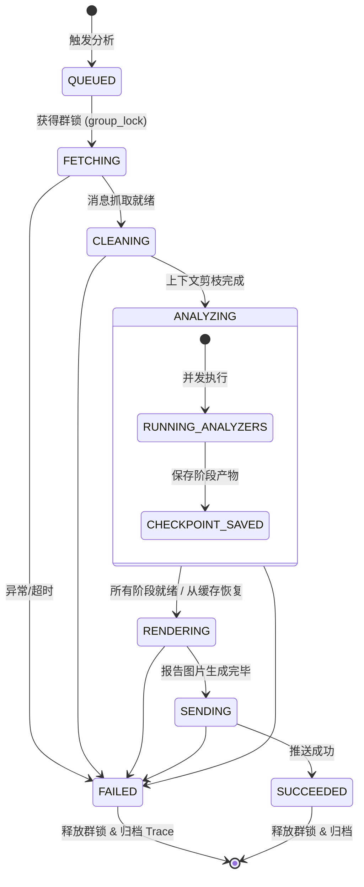

# 群日常分析插件基础设施升级与仪表盘架构提案
(Agent Infra & Context Insights & Web Dashboard Proposal)

---

## 1. 概述与核心愿景

### 1.1 背景与定位
`astrbot_plugin_qq_group_daily_analysis`（群日常分析插件）表面上是一个聊天机器人分析扩展，但系统本质是一个**多阶段、长耗时、高计算与网络密集型的异步 LLM 流水线（Multi-Stage Async Pipeline with Heavy LLM Workloads）**。

整个管线包含：
`海量原始消息拉取` $\to$ `规则清洗与剪枝` $\to$ `增量合并/滑动窗口切分` $\to$ `多维度并行 LLM 分析（话题/头衔/金句/漫画）` $\to$ `HTML/Playwright 图像排版渲染` $\to$ `跨平台静默推送`。

当前插件在面对长程运行、多群并发时，存在长程任务缺乏细粒度追踪、失败重试成本高（无断点续跑）、上下文演进与 Token 消耗黑盒、缺乏统一可视化运维面板等痛点。

---

### 1.2 核心理念融合

#### ① 大模型评测/执行基础设施（Agent Infra）的工程借鉴
在工业级大模型出题、评测与智能体沙箱执行基础设施（如 SWE-bench Runner、Agent 评测平台）中，核心关注的是：
* **任务状态机与生命周期管理**（Queued $\to$ Running $\to$ Succeeded / Failed $\to$ Retry）。
* **阶段快照与局部断点续跑（Stage Checkpoints & Partial Resume）**：当多个分析器（Analyzer）部分成功但后续渲染或单项超时失败时，保留已成功的阶段结果，重试时仅重跑失败步骤，节省巨额 Token 与时间。
* **任务防重、并发限流与自愈（Locking & Task Reaper）**：防止同群并发打架，并在后台自动回收超时假死的孤儿任务。

#### ② 上下文洞察与生命周期透视（深度参考 `dsh-context`）
* **什么是 `dsh-context`？**
  * 开源项目地址：[bowenliang123/dsh-context](https://github.com/bowenliang123/dsh-context)
  * **核心概念**：`dsh-context` 是面向 DeepSeek Harness 的一站式上下文洞察与管理插件。它致力于**透视上下文组成（System Prompt、历史消息、工具定义、检索上下文等）、追踪上下文在多轮交互与增量聚合中的演进/压缩/剪枝过程，并提供清晰的 Token 构成与成本统计面板**。
* **在群日常分析中的映射落地**：
  * **上下文演进漏斗（Context Funnel）**：追踪数千条群聊记录从“原始抓取”到“过滤无意义消息”，再到“增量压缩聚合”，最后进入各 Prompt 的保留率与剪枝比例。
  * **模块级 Token 账单（Token Usage Breakdown）**：清晰区分话题挖掘、人物画像、金句提取、漫画分镜各自消耗的 Prompt 与 Completion Token。
  * **交互快照（Prompt & Trajectory Inspector）**：支持抽屉式查看当时发送给 LLM 的实际上下文快照与原始回复，让上下文不再是“黑盒”。

#### ③ 优雅的交互分层原则（IM 极简反馈 + Web 控制台深度可观测）
* **IM 聊天端（QQ/TG/Lark/Discord）**：
  * 保持克制、标准、优雅的必要反馈：手动指令触发时给出轻量确认，执行失败时输出带 `TraceID` 的友好错误归因，最终产物呈递高清日报图片；**严禁**在 IM 群内反复高频编辑或刷屏发送多条百分比进度文本。
* **Web 控制台端（AstrBot 插件独立面板）**：
  * 承载所有深度可观测性能力：实时活跃任务、全链路甘特图瀑布流、Token 消耗账单、上下文演进漏斗、历史报告画廊与调试工具。

---

## 2. 关键参考文档与生态索引（相对路径）

在开发与实现过程中，请严格遵循 AstrBot 官方规范并参考成熟生态方案：

### 2.1 官方与项目规范文档
* **AstrBot 插件存储规范**：
  * 相对路径：`docs/zh/dev/star/guides/storage.md`
  * 规范要求：所有持久化数据（如 SQLite 数据库、缓存文件、图片产物）必须存放在 `StarTools.get_data_dir(PLUGIN_NAME)`（即 `data/plugin_data/<plugin_name>/`）。
* **AstrBot 插件 Pages 指南**：
  * 相对路径：`docs/zh/dev/star/guides/plugin-pages.md`
  * 规范要求：插件页面通过 `pages/<page_name>/index.html` 托管在受限 iframe 中，通过 `window.AstrBotPluginPage` bridge 与后端通过 `context.register_web_api()` 注册的 API 交互。
* **前端设计系统与 UI 风格规范（重要）**：
  * 相对路径：`docs/DASHBOARD_UI_STYLE_GUIDE.md`
  * 规范说明：控制台全面遵循 **数据密集与响应式设计系统（Data Dense & Responsive Utility）**。桌面端追求紧凑行高、等宽数据展示与零冗余留白；移动端自适应为紧凑卡片流。所有前端代码开发必须严格遵循该文档中的 Token 字典、禁止项与自检清单。

### 2.2 核心开源参考
* **上下文洞察参考**：
  * [bowenliang123/dsh-context](https://github.com/bowenliang123/dsh-context)：透视上下文组成、演进、压缩、剪枝等动作的最佳实践。
* **插件面板成熟实现参考**：
  * [exynos967/astrbot_plugin_memorix](https://github.com/exynos967/astrbot_plugin_memorix)（本地参考目录：`data/temp/memorix_ref`）：AstrBot 插件内嵌 WebUI 面板、Single-Bundle 编译、Iframe Bridge 适配与主题联动的完整工程范式。
* **Prompt 角色参考**：
  * [VoltAgent/awesome-claude-code-subagents](https://github.com/VoltAgent/awesome-claude-code-subagents)：专有角色 Agent 提示词设计。

---

## 3. 系统总体架构设计

```
┌──────────────────────────────────────────────────────────────────────────────────┐
│                            AstrBot WebUI Shell (Parent)                          │
└────────────────────────────────────────┬─────────────────────────────────────────┘
                                         │ Iframe Bridge (window.AstrBotPluginPage)
┌────────────────────────────────────────▼─────────────────────────────────────────┐
│                 Plugin Dashboard (React 18/19 + Ant Design 5)                    │
│  ┌────────────────────┬────────────────────┬──────────────────┬───────────────┐  │
│  │ 🚀 实时任务看板    │ 🔍 链路追溯(甘特图)│ 🧠 上下文&Token  │ 📁 历史报告库 │  │
│  └────────────────────┴────────────────────┴──────────────────┴───────────────┘  │
└────────────────────────────────────────┬─────────────────────────────────────────┘
                                         │ HTTP REST / SSE (context.register_web_api)
┌────────────────────────────────────────▼─────────────────────────────────────────┐
│                      Plugin Backend Infrastructure Layer                          │
│                                                                                  │
│  ┌───────────────────────┐  ┌───────────────────────┐  ┌──────────────────────┐  │
│  │  PluginPageWebUIBridge │  │   ActiveTaskManager   │  │   TaskReaperDaemon   │  │
│  │  (REST / SSE Handlers)│  │   (Concurrency/Locks) │  │   (Timeout Recovery) │  │
│  └───────────┬───────────┘  └───────────┬───────────┘  └──────────┬───────────┘  │
│              │                          │                         │              │
│  ┌───────────▼──────────────────────────▼─────────────────────────▼───────────┐  │
│  │                 TraceStore & CheckpointStore (SQLite)                      │  │
│  │     (Located at: StarTools.get_data_dir(PLUGIN_NAME) / "traces.db")        │  │
│  └──────────────────────────────────────┬─────────────────────────────────────┘  │
│                                         │                                        │
│  ┌──────────────────────────────────────▼─────────────────────────────────────┐  │
│  │               Enhanced TraceContext (Span-based Tracing)                   │  │
│  └──────────────────────────────────────┬─────────────────────────────────────┘  │
└─────────────────────────────────────────┼────────────────────────────────────────┘
                                          │
┌─────────────────────────────────────────▼────────────────────────────────────────┐
│                   Multi-Stage Analysis Pipeline (Core Domain)                     │
│                                                                                  │
│  [ Stage 1: Fetch & Stats ] ──> [ Stage 2: Clean & Context Funnel ]              │
│                                                │                                 │
│        ┌───────────────────────────────────────┴──────────────────────┐          │
│        ▼ (Parallel Analyzers with Stage Checkpoint Cache)             ▼          │
│   [ Topic LLM ]    [ Persona LLM ]    [ Quote LLM ]    [ Comic LLM & T2I ]       │
│        └───────────────────────────────────────┬──────────────────────┘          │
│                                                │                                 │
│  [ Stage 4: HTML / Chart Image Render ] ───> [ Stage 5: Multi-Platform Push ]     │
└──────────────────────────────────────────────────────────────────────────────────┘
```

---

## 4. 核心模块与实现细节

### 4.1 数据持久化设计 (SQLite Store)

* **存储路径**：`StarTools.get_data_dir(PLUGIN_NAME) / "traces.db"`
* **技术特性**：轻量级嵌入式 SQLite，WAL 模式，零额外守护进程，单任务写入耗时 $< 1\text{ms}$，内置 30 天 / 最近 1000 条自动滚动清理。

#### 核心数据表设计
1. **`analysis_traces`**：主任务链路快照
   * `trace_id` (TEXT PK): 语义化链路 ID（如 `manual_交流群_2105`）
   * `group_id` (TEXT): 群组 ID
   * `platform` (TEXT): 来源平台 (`qq`, `telegram`, `lark`, `discord`)
   * `trigger_type` (TEXT): 触发模式 (`manual`, `auto`, `api`)
   * `status` (TEXT): 状态 (`running`, `succeeded`, `failed`, `aborted`)
   * `started_at` (REAL), `completed_at` (REAL), `duration_ms` (REAL)
   * `error_stage` (TEXT), `error_message` (TEXT), `stack_trace` (TEXT)
2. **`trace_spans`**：细粒度步骤与耗时（用于甘特图）
   * `span_id` (TEXT PK), `trace_id` (TEXT FK)
   * `stage_name` (TEXT): `FETCH_MESSAGES`, `CLEAN_PRUNE`, `LLM_TOPICS`, `LLM_TITLES`, `LLM_QUOTES`, `DRAW_COMIC`, `RENDER_REPORT`, `PUSH_MESSAGE`
   * `status` (TEXT): `success`, `failed`, `skipped`
   * `started_at` (REAL), `duration_ms` (REAL)
   * `stage_payload_json` (TEXT): 阶段调试快照
3. **`context_metrics`**：上下文演进指标（`dsh-context` 特性）
   * `trace_id` (TEXT PK_FK)
   * `raw_message_count` (INT): 原始拉取消息数
   * `cleaned_message_count` (INT): 清洗后有效消息数
   * `compression_ratio` (REAL): 消息保留比例 ($Cleaned / Raw$)
   * `incremental_batches` (INT): 增量分批数
4. **`token_usage`**：Token 账单审计
   * `trace_id` (TEXT PK_FK)
   * `prompt_tokens` (INT), `completion_tokens` (INT), `total_tokens` (INT)
   * `estimated_cost` (REAL): 预估花费
   * `per_analyzer_tokens_json` (TEXT): 各 Analyzer 细分消耗

---

### 4.2 任务状态机、断点续跑与自愈机制



1. **群组互斥锁与防重（Idempotency & Group Locking）**：
   * 基于 `WeakValueDictionary` 维护 `f"{task_type}:{group_id}"`。
   * 同群同一时间只允许一个分析任务执行，重复请求直接阻断（抛出 `DuplicateGroupTaskError`）。
2. **Stage Checkpoint 缓存与局部断点续跑（Partial Resume）**：
   * 话题分析、头衔分析、金句分析独立执行。完成任一阶段后，将 JSON 结果存入临时 Checkpoint 缓存（有效时间 30 分钟）。
   * 若后续因绘图接口超时或渲染抖动导致任务失败，重试触发时**直接复用已完成阶段的数据**，只重跑失败的 Step，将重试时间缩短至秒级并节省 80%+ 的 Token。
3. **孤儿任务超时回收守护器（Task Reaper Daemon）**：
   * 后台异步巡检协程定期扫描长时间处于 `running` 且未更新心跳的任务（如超时 10 分钟），自动标记为 `TIMED_OUT` 并强制释放残留群锁，杜绝 Bot 重启或崩溃引发的群组假死。

---

### 4.3 IM 端交互体验与错误归因设计

保持 IM 交互简洁优雅，拒绝粗糙刷屏：

1. **手动触发响应（Manual Trigger）**：
   * 收到 `/群分析` 指令后，立即返回一条简明确认（例如：`⏳ 正在分析群聊数据并生成报告，请稍候...`）。
2. **优雅错误归因（Explainable Failure）**：
   * 若分析失败，输出清晰归因与短 Trace ID：
     > `❌ 今日群分析生成失败：LLM 接口响应超时 (429 RateLimit)`  
     > `TraceID: manual_系统交流群_2105`  
     > `管理员可在 Web 控制台查看详细链路。`
3. **定时任务静默执行（Scheduled Run）**：
   * 每日自动定时分析在后台静默进行，渲染完成后直接发送最终精美图片，不发送中间过渡消息。

---

### 4.4 前端控制台设计 (React + Ant Design 5)

> 💡 **前端设计系统与代码规范**：控制台开发严格遵循 [`docs/DASHBOARD_UI_STYLE_GUIDE.md`](./DASHBOARD_UI_STYLE_GUIDE.md) 中定义的 **数据密集与响应式设计系统（Data Dense & Responsive Utility）**。桌面端优先保证高信息密度与严格紧凑排版，移动端自适应为轻量卡片流。

#### 1. 前端目录与打包规范
* **源码目录**：`dashboard/`（与 AstrBot 根项目规范对齐）。
* **产物目录**：`pages/daily-analysis/`。
* **技术栈**：`React 18/19` + `TypeScript` + `Ant Design 5` (`antd`) + `@ant-design/icons` + `ECharts`。
* **Vite 单 Bundle 配置（解决 Iframe 沙箱 CORS 限制）**：
  ```typescript
  // dashboard/vite.config.ts
  import { defineConfig } from "vite";
  import react from "@vitejs/plugin-react";
  import { fileURLToPath, URL } from "node:url";

  export default defineConfig({
    base: "./", // 必须使用相对路径
    plugins: [react()],
    resolve: {
      alias: {
        "@": fileURLToPath(new URL("./src", import.meta.url)),
      },
    },
    build: {
      outDir: "../pages/daily-analysis",
      emptyOutDir: true,
      cssCodeSplit: false,
      rollupOptions: {
        output: {
          inlineDynamicImports: true, // 单 bundle 杜绝 iframe CORS
        },
      },
    },
  });
  ```
* **主题自适应**：
  ```tsx
  import React, { useEffect, useState } from "react";
  import { ConfigProvider, theme } from "antd";

  export const App: React.FC = () => {
    const [isDark, setIsDark] = useState(false);

    useEffect(() => {
      const bridge = (window as any).AstrBotPluginPage;
      if (bridge) {
        bridge.ready().then((ctx: any) => setIsDark(!!ctx?.isDark));
        const off = bridge.onContext((ctx: any) => setIsDark(!!ctx?.isDark));
        return () => off();
      }
    }, []);

    return (
      <ConfigProvider theme={{ algorithm: isDark ? theme.darkAlgorithm : theme.defaultAlgorithm }}>
        {/* 控制台路由与面板组件 */}
      </ConfigProvider>
    );
  };
  ```

#### 2. 控制台四大核心视图
* **视图 1：实时任务与总览（Overview & Active Tasks）**
  * 统计卡片：今日分析群数、平均耗时、Token 累计花费。
  * 正在运行的任务实时列表，支持手动 **【中止】** 或 **【立即触发分析】**。
* **视图 2：链路追踪追溯台（Trace Explorer & Waterfall）**
  * `<Table>` 展示历史所有分析记录（支持按群号、日期、状态过滤）。
  * 点击记录弹出 `<Drawer>` 抽屉：
    * **甘特图/时间轴 (`<Timeline>`)**：清晰展现拉取 $\to$ 清洗 $\to$ 并行 LLM $\to$ 渲染的各阶段耗时。
    * **调用栈排查器 (`<Alert>`)**：直接显示失败原因与 Python Traceback。
* **视图 3：上下文与 Token 演进洞察（Context & Token Insights - `dsh-context`）**
  * **消息清洗漏斗 (`<Progress>`)**：展示原始消息经过规则过滤后的留存比例。
  * **Token 消耗占比饼图**：话题 vs 头衔 vs 金句 vs 漫画分镜消耗分布。
  * **Prompt 快照抽屉**：折叠查看发给大模型的实际提示词与原始返回。
* **视图 4：历史报告归档库（Report Gallery）**
  * 画廊式浏览已生成的日报长图与漫画。
  * 支持在 Web 端基于已持久化数据“切换模板一键重新渲染”。

---

### 4.5 后端 Web API 路由设计

在 Python 侧通过 `context.register_web_api()` 注册轻量 REST/SSE 接口：

| HTTP 方法 | 路径 (相对于插件前缀) | 说明 |
| :--- | :--- | :--- |
| `GET` | `/tasks/active` | 获取当前活跃执行的任务列表 |
| `POST` | `/tasks/trigger` | Web 界面手动触发指定群的分析任务 |
| `POST` | `/tasks/cancel` | 中止指定正在运行的任务 |
| `GET` | `/traces` | 分页与多维查询 Trace 记录 (支持群组、日期范围、状态、关键词筛选及耗时/Token排序) |
| `GET` | `/traces/<trace_id>` | 获取单个 Trace 的完整 Span 树、错误调用栈与上下文详情 |
| `GET` | `/groups` | 获取所有有分析记录的群组列表 (供前端下拉快速检索) |
| `GET` | `/metrics/summary` | 获取控制台统计卡片与 30 天 Token 趋势数据 |
| `GET` | `/reports/history` | 查询历史生成的报告图片文件列表 |
| `GET` | `/events/stream` | SSE 实时事件流 (向 WebUI 实时广播任务进度与状态变更) |

---

## 5. 重构与死代码清理指导原则

在本次基础设施升级与 Web 控制台接入过程中，**明确允许并鼓励对不再有效的设计与死代码进行合理重构**，遵循以下原则：

1. **剔除无用抽象（No Unnecessary Abstraction & KISS）**：
   * 凡是仅调用一次、却跨越了多层转发的冗余 Helper 类，坚决内联或重构简化。
   * 移除散落在各处的临时全局调试变量，统一收敛至 `TraceContext`。
2. **清理过时产物与代码**：
   * 彻底清理历史残留的 PDF 生成废弃逻辑与临时测试脚本，全面统一为 HTML-to-Image / Playwright 图像管线。
   * 清理此前为了在 IM 端实现非标准进度汇报所写的临时 hack 逻辑。
3. **数据层规范收敛**：
   * 将散落在 `debug_data/`、临时 JSON 文件中的零散日志与状态，全面平移整合至 SQLite 数据库中，保持 `plugin_data` 目录整洁合规。
4. **保持核心领域逻辑稳定**：
   * 消息清洗规则、Prompt 模板、图像渲染引擎作为核心资产予以保留，仅对调度器、上下文传递层与持久化层进行适配改造。

---

## 6. 分阶段落地实施路线图与交付状态 (Phased Roadmap & Status)

```
┌────────────────────────────────────────────────────────────────────────┐
│ [✓] Phase 1: 基础设施持久化层 (SQLite TraceStore + 增强版 TraceContext)  │
│   - 实现 traces.db 数据库创建与读写 (存储于 plugin_data 规范路径)       │
│   - 完善 Span 耗时打点、Token 统计与 Context Funnel 计数器             │
│   - 支持 30 天 / 20000 条滚动容量与全字段索引检索                       │
├────────────────────────────────────────────────────────────────────────┤
│ [✓] Phase 2: 后端 Web API 与桥接适配 (PluginPageWebUIBridge)             │
│   - 注册 /traces, /tasks, /metrics, /groups, /events 等 REST & SSE 接口│
│   - 实现 Task Reaper 孤儿锁清理机制与开机自愈对账 (Startup Sweep)       │
├────────────────────────────────────────────────────────────────────────┤
│ [✓] Phase 3: 前端控制台工程开发 (dashboard/ - React + Ant Design 5)      │
│   - 初始化 React 18 + Antd 5 + Vite 脚手架                             │
│   - 封装 bridge.ts 通信层与暗黑主题联动                                │
│   - 完成 Overview, TraceList, Drawer, Token Insights 四大核心视图      │
│   - 集成 DatePicker.RangePicker 日期区间、群组下拉搜索与多字段排序     │
│   - 编译输出至 pages/daily-analysis/ 单文件 Bundle 适配受限 Iframe     │
├────────────────────────────────────────────────────────────────────────┤
│ [✓] Phase 4: 断点续跑与 Stage Checkpoint 缓存 (30 天生命周期)           │
│   - 实现 Analyzer 阶段产物缓存与局部重试逻辑                           │
│   - Checkpoint 与 Trace 保留期完全对齐 (30 天)，杜绝短命失效           │
├────────────────────────────────────────────────────────────────────────┤
│ [✓] Phase 5: 测试验证与代码质量治理                                    │
│   - 覆盖 TraceStore, CheckpointStore, ActiveTaskManager 全套测试       │
│   - 141 项自动化单元测试 100% 全部通过 (耗时 12.74s)                    │
│   - 运行 ruff format 与 ruff check，代码 0 错误 0 警告                  │
└────────────────────────────────────────────────────────────────────────┘
```
